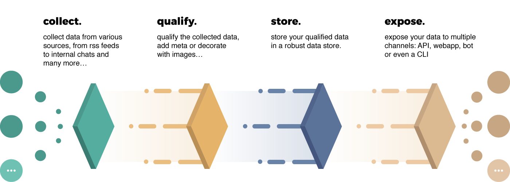

[![Travis CI][travis-image]][travis-url]

**flambo** is a content aggregation platform built upon Node.js.

## Features

- Groups to help grouping data by topic
- Collections to let users manage their very own feed
- Sources pull data from various providers, for now:
    - RSS feeds
    - Meetup
    - hoping to add more in the future (contributions are welcome :))



## Components

**flambo** is made up of several components

| component         | directory                 | package |
| ----------------- | ------------------------- | ------- |
| **API**           | `/api`                    | *n/a*   |
| **bot**           | `/packages/bot`           | `@flambo/bot` [](https://www.npmjs.com/package/@flambo/bot) |
| **CLI**           | `/packages/cli`           | `@flambo/cli` [](https://www.npmjs.com/package/@flambo/cli) |
| **webapp**        | `/webapp`                 | *n/a*   |
| **RSS source**    | `/packages/source-rss`    | `@flambo/source-rss` [](https://www.npmjs.com/package/@flambo/source-rss) |
| **Meetup source** | `/packages/source-meetup` | `@flambo/source-meetup` [](https://www.npmjs.com/package/@flambo/source-meetup) |
| **website**       | `/website`                | *n/a*   |

## Requirements

- docker
- docker-compose
- Node 7.6

## API

### Authentication

In order to perform calls on the API, you must be authenticated,
use the login endpoint to retrieve a token and then add an `Authorization` header
to your requests:

```
Authorization: Bearer <TOKEN>
```

### Pagination

Apart from using standard pagination through `page` & `per_page` query parameters,
some endpoints use cursor based pagination, that means that you cannot jump to arbitrary
page, you must follow first query result to fetch next one:

```
# first call, retrieving first 5 users
GET /api/v1/users?first=5

{
  "edges": [ … ],
  "pageInfo": {
    "endCursor": "eyJzZXJpYWwiOiIxNDk0ODk5MzIyMDAwMDAwMDAwMDAwMDAwMDAwNTEifQ==",
    "hasNextPage": false
  }
}

# then you can use the end cursor to fetch next users
GET /api/v1/users?first=5&after=eyJzZXJpYWwiOiIxNDk0ODk5MzIyMDAwMDAwMDAwMDAwMDAwMDAwNTEifQ==
```

If you're curious, you should read [this documentation page](http://graphql.org/learn/pagination/)
from the graphql website.

[travis-image]: https://img.shields.io/travis/plouc/flambo.svg?style=flat-square
[travis-url]: https://travis-ci.org/plouc/flambo
